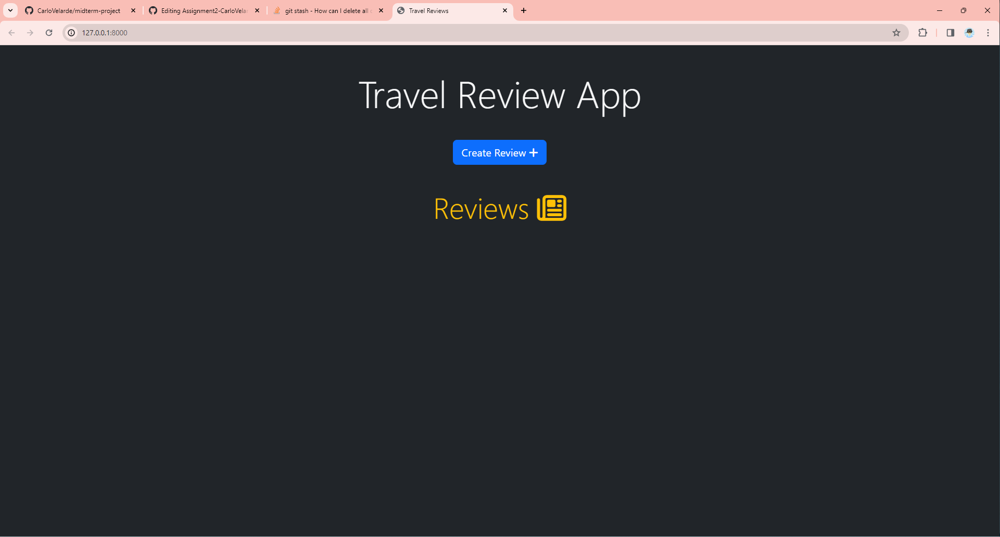
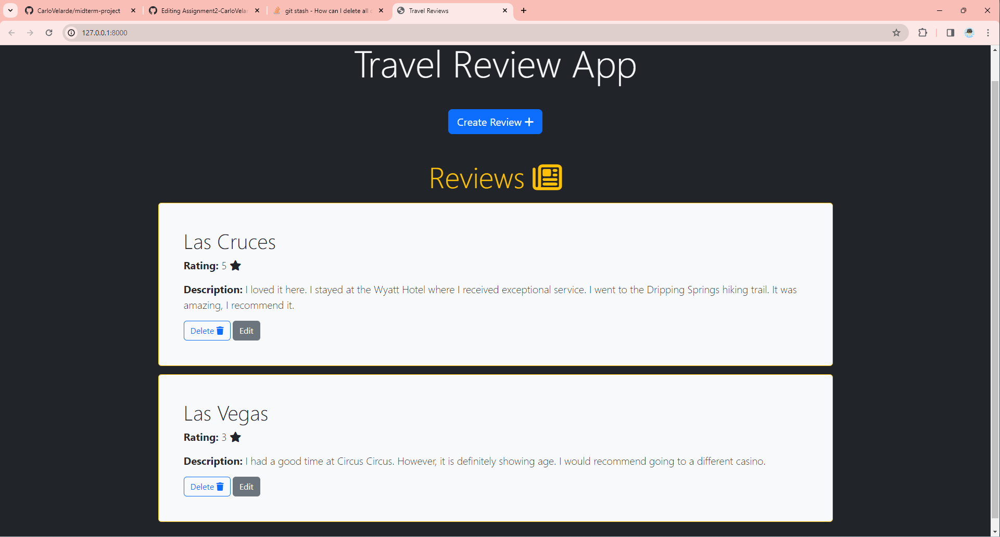
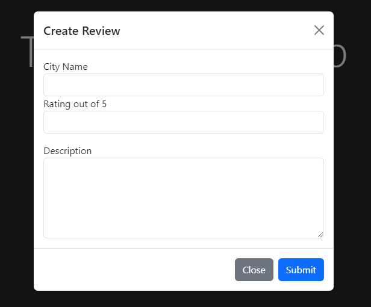
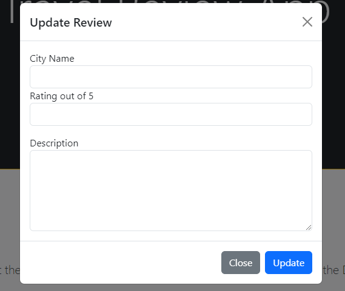
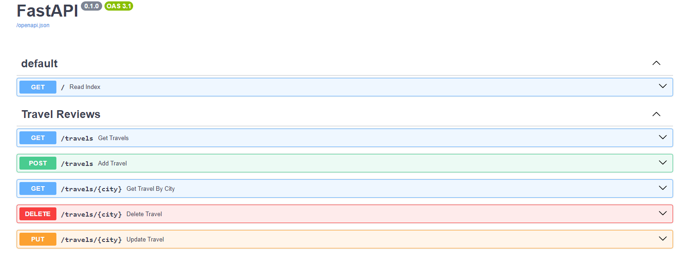

# Midterm Project: Review App

## TOC
* All python files (backend), frontend folder, and assets folder are in the base of the parent directory
* Frontend folder consists of index.html, script.js, and style.css
* Assets folder consists of images that show the programs functionality

## About 
* This program is currently in its beginning stage where it is simply a representation of a greater idea.
* The program represents a Review app where users can write reviews about different cities they have been to.
* The idea behind the program is that users can refer back to their reviews for some good memories or to even prepare for the next time they return to the city.
   * A future goal is that users can share their reviews. This would allow for users who have never been to certain cities to be able to read other reviews. In return, users would get an idea of what to do and not to do.
* The program is controlled by a custom api created by Fastapi with post, get, put, and delete methods.  

## Getting Started
* Clone the repo
* Create a virtual environment
   * For __windows__: ``python -m venv venv``
   * For __mac__: ``python3 -m venv venv``
* Activate the virtual environment 
   * For __windows__: ``venv\scripts\activate``
   * For __mac__: ``source venv/bin/activate``
* Install the required packages
   * pip install -r requirements.txt
* Open a terminal and cd into the directory 
* Type into the terminal: ``uvicorn main:app --reload``
* Click on the http link: "http://127.0.0.1:8000"

## Visual of the Project

### Homepage
* 
### Homepage with reviews
* 
### Add review page
* 
### Update review page
* 
### Swagger documentation
* 